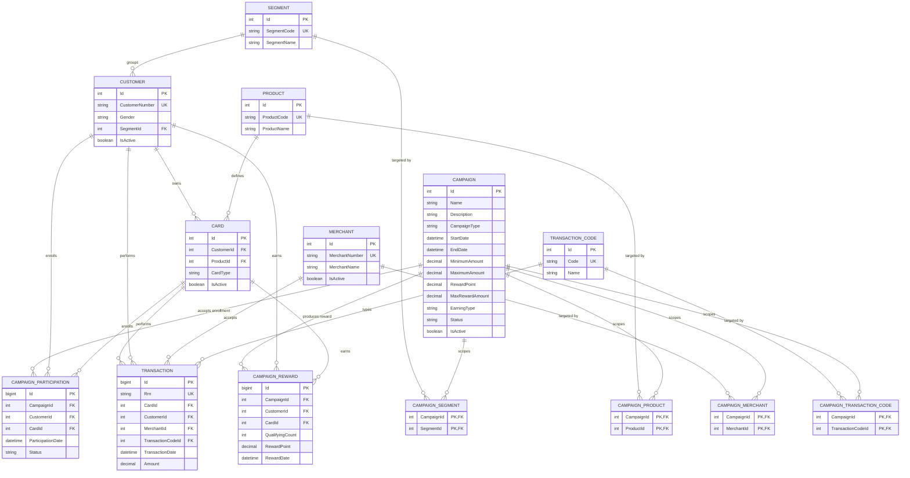

# CampaignSystem — Database Design

Batch campaign definition and evaluation system for credit cards.

- **Single source of truth for the schema:** [`schema.dbml`](schema.dbml) — open with dbdiagram.io
- **ORM:** Entity Framework Core (Code First + migrations)
- **Database:** MSSQL

Order of change: `schema.dbml` → entity class → migration. Never the other way around.

---

## Business flow

1. A campaign is defined by the business development team, together with its criteria
2. It waits until its start date (`Status = Pending`)
3. The start date arrives and the campaign runs (`Status = Ongoing`)
4. If the campaign requires enrollment (`CampaignType = SI`), customers enroll
5. Customer transactions accumulate over the campaign period
6. The end date passes and the batch job takes the campaign up (`Status = Loading`)
7. Qualifying transactions are identified, rewards are calculated and posted
8. The campaign is closed (`Status = Ended`)

Evaluation happens **once** — the batch job runs a single time after the campaign ends.

`Status` follows the batch pipeline, not an approval chain: `Pending → Ongoing → Loading → Ended`.

---

## ER Diagram



---

## A. Lookup tables

### SEGMENT
Customer group.

| Column | Type | Notes |
|---|---|---|
| Id | int | PK, identity |
| SegmentCode | varchar(10) | UNIQUE, NOT NULL |
| SegmentName | nvarchar(100) | NOT NULL |

### PRODUCT
Card product (Classic, Gold, Platinum, etc.)

| Column | Type | Notes |
|---|---|---|
| Id | int | PK, identity |
| ProductCode | varchar(10) | UNIQUE, NOT NULL |
| ProductName | nvarchar(100) | NOT NULL |

### MERCHANT

| Column | Type | Notes |
|---|---|---|
| Id | int | PK, identity |
| MerchantNumber | varchar(20) | UNIQUE, NOT NULL (BKM ID) |
| MerchantName | nvarchar(200) | NOT NULL |
| IsActive | bit | default 1 |

### TRANSACTION_CODE
Transaction type.

| Column | Type | Notes |
|---|---|---|
| Id | int | PK, identity |
| Code | varchar(10) | UNIQUE, NOT NULL |
| Name | nvarchar(100) | NOT NULL |

---

## B. Customer and card

### CUSTOMER

| Column | Type | Notes |
|---|---|---|
| Id | int | PK, identity |
| CustomerNumber | varchar(20) | UNIQUE, NOT NULL |
| Gender | varchar(1) | null — `E` = male, `K` = female |
| SegmentId | int | FK → SEGMENT, null |
| IsActive | bit | default 1 |

### CARD

| Column | Type | Notes |
|---|---|---|
| Id | int | PK, identity |
| CustomerId | int | FK → CUSTOMER, NOT NULL |
| ProductId | int | FK → PRODUCT, NOT NULL |
| CardType | varchar(1) | null — `A` = primary, `E` = supplementary |
| IsActive | bit | default 1 |

Index: `(CustomerId)`

The clear card number is **never stored in any table** (PCI DSS).

---

## C. Campaign definition

### CAMPAIGN

| Column | Type | Notes |
|---|---|---|
| Id | int | PK, identity |
| Name | nvarchar(200) | NOT NULL |
| Description | nvarchar(1000) | null |
| CampaignType | varchar(10) | NOT NULL — `MASS` = no enrollment, `SI` = enrollment required |
| StartDate | datetime2 | NOT NULL |
| EndDate | datetime2 | NOT NULL |
| MinimumAmount | decimal(18,2) | null — lower bound per transaction |
| MaximumAmount | decimal(18,2) | null — upper bound per transaction |
| RewardPoint | decimal(18,2) | null — points per qualifying transaction |
| MaxRewardAmount | decimal(18,2) | null — reward cap for the whole campaign |
| EarningType | varchar(2) | NOT NULL — `K` = accumulate per card, `M` = accumulate per customer |
| Status | varchar(20) | NOT NULL — stored as the enum member name: `Pending`, `Ongoing`, `Loading`, `Ended` |
| IsActive | bit | default 1 |

Index: `(Status, EndDate)` — the campaign selection query of the batch job

### Criteria junction tables

All four follow the same template — two columns, both PK and FK:

**CAMPAIGN_SEGMENT** · **CAMPAIGN_PRODUCT** · **CAMPAIGN_MERCHANT** · **CAMPAIGN_TRANSACTION_CODE**

| Column | Type | Notes |
|---|---|---|
| CampaignId | int | PK, FK → CAMPAIGN |
| *(SegmentId / ProductId / MerchantId / TransactionCodeId)* | int | PK, FK |

The scope of a campaign is defined by these rows; there are no hardcoded values in the application code.

---

## D. Enrollment

### CAMPAIGN_PARTICIPATION

Enrollment record for campaigns where `CampaignType = SI`.

| Column | Type | Notes |
|---|---|---|
| Id | bigint | PK, identity |
| CampaignId | int | FK → CAMPAIGN, NOT NULL |
| CustomerId | int | FK → CUSTOMER, NOT NULL |
| CardId | int | FK → CARD, null — null for customer level enrollment |
| ParticipationDate | datetime2 | NOT NULL |
| Status | varchar(20) | NOT NULL — stored as the enum member name, e.g. `Active` |

**UNIQUE: `(CampaignId, CustomerId, CardId)` — deliberately unfiltered**

The index must cover the rows where `CardId` is null, because those are the customer level enrollments. SQL Server compares two NULLs as equal inside a unique index, so an unfiltered index limits a customer to one customer level enrollment per campaign. EF Core adds `WHERE CardId IS NOT NULL` to such an index by default, which would remove exactly that protection; the configuration overrides it with `HasFilter(null)`.

> Enrollment is the customer's intent; eligibility is the batch job's decision. Eligibility is not stored in this table.

---

## E. Transaction data

### TRANSACTION

The main table read by the batch job. It will be the largest table in the system.

| Column | Type | Notes |
|---|---|---|
| Id | **bigint** | PK, identity — int is not enough |
| Rrn | varchar(24) | UNIQUE, null — unique business key of the transaction |
| CardId | int | FK → CARD, NOT NULL |
| CustomerId | int | FK → CUSTOMER, NOT NULL |
| MerchantId | int | FK → MERCHANT, null |
| TransactionCodeId | int | FK → TRANSACTION_CODE, NOT NULL |
| TransactionDate | datetime2 | NOT NULL |
| Amount | decimal(18,2) | NOT NULL |

Indexes:
- `(CustomerId, TransactionDate)` — the main query of the batch job
- `(CardId, TransactionDate)`
- `(MerchantId)`
- UNIQUE filtered `(Rrn) WHERE Rrn IS NOT NULL` — guards against duplicate loads

`CustomerId` is stored even though it can be derived through `CardId`; this avoids a JOIN in customer level aggregation.

---

## F. Reward

### CAMPAIGN_REWARD

The result table written by the end-of-campaign batch job.

| Column | Type | Notes |
|---|---|---|
| Id | bigint | PK, identity |
| CampaignId | int | FK → CAMPAIGN, NOT NULL |
| CustomerId | int | FK → CUSTOMER, NOT NULL |
| CardId | int | FK → CARD, null — null for customer level reward |
| QualifyingCount | int | NOT NULL — number of qualifying transactions |
| RewardPoint | decimal(18,2) | NOT NULL — points granted |
| RewardDate | datetime2 | NOT NULL |

**UNIQUE: `(CampaignId, CustomerId, CardId)` — deliberately unfiltered**

This constraint prevents double rewards at the database level. If the batch job runs twice by mistake, the second run fails instead of silently creating duplicate rows. Do not rely on application-level checks alone — add the constraint.

The index must stay unfiltered for the same reason as in CAMPAIGN_PARTICIPATION: a customer level reward carries a null `CardId`, and a `WHERE CardId IS NOT NULL` filter would exclude precisely those rows from the constraint. Customer level campaigns — the `M` earning type — would then be the only ones left unprotected against a duplicate run.

---

## Reward calculation

The batch job first filters qualifying transactions:

```
qualifying transactions =
    TRANSACTION
    WHERE TransactionDate BETWEEN Campaign.StartDate AND Campaign.EndDate
      AND (Campaign.MinimumAmount IS NULL OR Amount >= Campaign.MinimumAmount)
      AND (Campaign.MaximumAmount IS NULL OR Amount <= Campaign.MaximumAmount)
      AND MerchantId         IN (CAMPAIGN_MERCHANT)          -- only if rows exist
      AND TransactionCodeId  IN (CAMPAIGN_TRANSACTION_CODE)  -- only if rows exist
      AND Card.ProductId     IN (CAMPAIGN_PRODUCT)           -- only if rows exist
      AND Customer.SegmentId IN (CAMPAIGN_SEGMENT)           -- only if rows exist
```

If a criteria junction table has no rows for the campaign, that criterion is not applied — the campaign is unrestricted on that dimension.

`EarningType` then decides at which level those transactions are grouped, and therefore how many reward rows one customer receives:

```
IF EarningType = 'K'    -- accumulate per card
    GROUP BY CardId     -- one reward row per card, CardId populated
ELSE                    -- 'M', accumulate per customer
    GROUP BY CustomerId -- one reward row per customer, CardId left null
                        -- transactions from all of the customer's cards are pooled

for each group:
    QualifyingCount = number of qualifying transactions in the group
    reward          = QualifyingCount * Campaign.RewardPoint

    IF Campaign.MaxRewardAmount IS NOT NULL
        reward = MIN(reward, Campaign.MaxRewardAmount)

    write to CAMPAIGN_REWARD
```

A customer holding three cards therefore receives three reward rows under `K` and a single pooled row under `M`. The null `CardId` of an `M` row is not missing data — it states that the reward belongs to the customer rather than to any one card.

---

## Reference data

Seed data loaded on first setup.

### SEGMENT

| SegmentCode | SegmentName |
|---|---|
| OGR | Student |
| PER | Company Employee |
| CFT | Farmer |
| EVH | Homemaker |
| EMK | Retiree |

### PRODUCT

| ProductCode | ProductName |
|---|---|
| 201 | Visa Classic |
| 202 | MasterCard Classic |
| 203 | Visa Gold |
| 204 | MasterCard Gold |
| 205 | Platinum Plus |
| 206 | Platinum Plus Metal |

### MERCHANT

| MerchantNumber | MerchantName |
|---|---|
| 000145 | Grande Cafe |
| 000912 | Köfteci Yusuf |
| 000874 | Opet |

### TRANSACTION_CODE

| Code | Name |
|---|---|
| SA | Sale |
| NA | Cash Advance |
| OD | Debt Payment |

---

## Sample campaign definition

*"July fuel campaign" — 50 points per sale transaction over 250 TL at Opet, for Gold and above cardholders in the Farmer and Company Employee segments. Capped at 500 points for the whole campaign.*

**CAMPAIGN**

| Field | Value |
|---|---|
| Name | July Fuel Campaign |
| CampaignType | MASS |
| StartDate / EndDate | 2026-07-01 / 2026-07-31 |
| MinimumAmount | 250.00 |
| RewardPoint | 50.00 |
| MaxRewardAmount | 500.00 |
| EarningType | K (accumulate per card) |
| Status | Ongoing |

**Criteria junction tables**

| Table | Rows |
|---|---|
| CAMPAIGN_SEGMENT | CFT, PER |
| CAMPAIGN_PRODUCT | 203, 204, 205, 206 |
| CAMPAIGN_MERCHANT | 000874 (Opet) |
| CAMPAIGN_TRANSACTION_CODE | SA |

**8 junction rows** for a single campaign.

---

## Design rules

- Money and point fields are **`decimal(18,2)`** — never `float` / `double`
- Code columns are **`varchar`**, human-readable columns are **`nvarchar`**. Codes (`SegmentCode`, `ProductCode`, `MerchantNumber`, `CustomerNumber`, `Rrn`, and every enum code column) only ever hold ASCII, so Unicode storage would double their size for nothing. Names and descriptions are `nvarchar` so Turkish characters survive
- Enums are persisted as **strings**, not as the integer values C# assigns, so a row read straight from the database is readable and a reordering of the enum members cannot change the meaning of stored data
- Dates are **`datetime2`**, not `datetime` — wider range, higher precision, same storage
- The clear card number is **never stored in any table** (PCI DSS)
- Deletion is **soft delete** (`IsActive = 0`) — rows are never physically removed
- No campaign rule is hardcoded; the scope is always read from the junction tables

---
