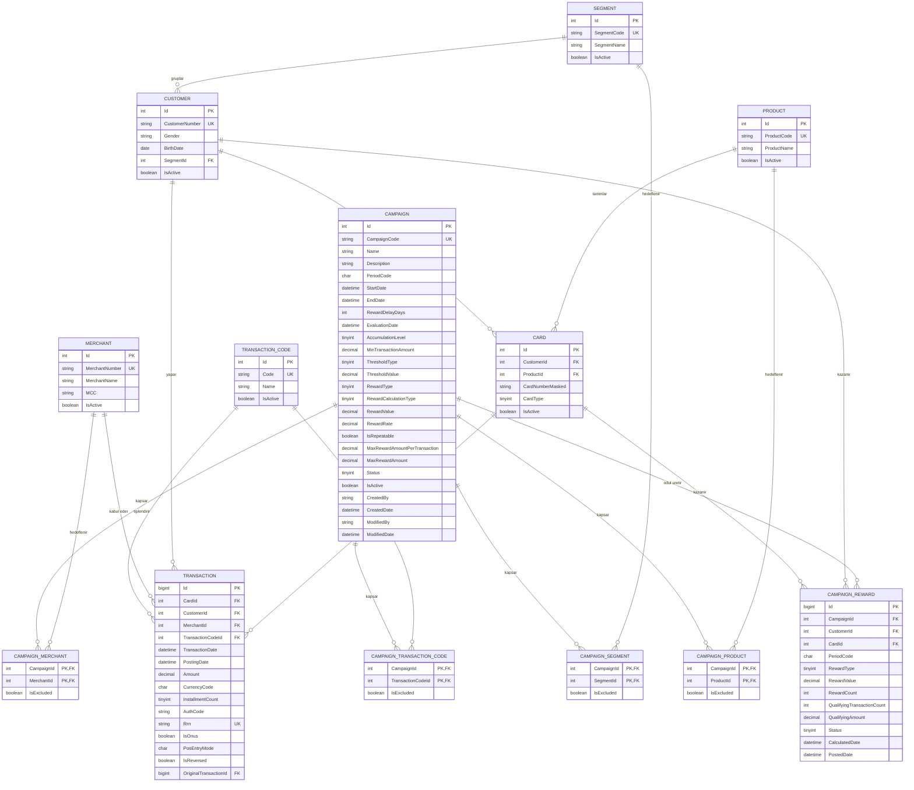

# CampaignSystem — v1 Kapsamı

Bu doküman **ilk sürümde inşa edilecek** tabloları tanımlar.

Tam tasarım için → [`veritabani-tasarimi.md`](veritabani-tasarimi.md)

**Temel kural:** Yeni tablo eklemek ucuzdur, mevcut tabloyu değiştirmek pahalıdır.
v1'den çıkarılan her şey, sonradan **mevcut yapıya dokunmadan** eklenebilecek şeylerdir.

---

## Kapsam özeti

| | v1 | Ertelenen |
|---|---|---|
| Tablo sayısı | **13** | 3 |
| `CAMPAIGN` kolonu | **26** | 6 |
| Ödül modu | **1** (eşik bazlı) | 2 |

### v1 tabloları

| # | Tablo | Rol |
|---|---|---|
| 1 | `SEGMENT` | Müşteri grubu sözlüğü |
| 2 | `PRODUCT` | Kart ürünü sözlüğü |
| 3 | `MERCHANT` | Üye işyeri sözlüğü |
| 4 | `TRANSACTION_CODE` | İşlem kodu sözlüğü |
| 5 | `CUSTOMER` | Müşteri |
| 6 | `CARD` | Kart |
| 7 | `CAMPAIGN` | Kampanya tanımı |
| 8 | `CAMPAIGN_SEGMENT` | Kriter — müşteri grubu |
| 9 | `CAMPAIGN_PRODUCT` | Kriter — ürün kodu |
| 10 | `CAMPAIGN_MERCHANT` | Kriter — üye işyeri |
| 11 | `CAMPAIGN_TRANSACTION_CODE` | Kriter — işlem kodu |
| 12 | `TRANSACTION` | İşlem verisi |
| 13 | `CAMPAIGN_REWARD` | Hesaplanan ödül |

### v1'e alınmayanlar

| Ne | Neden ertelenebilir |
|---|---|
| `CAMPAIGN_PARTICIPATION` | Yeni tablo — v1'de tüm kampanyalar katılımsız çalışır |
| `BATCH_RUN` | Yeni tablo — koşum logu olmadan da batch çalışır |
| `CAMPAIGN_REWARD_DETAIL` | Yeni tablo — hangi işlemin katkı yaptığı v1'de izlenmez |
| `CampaignType` | Nullable kolon — v1'de tüm kampanyalar Mass |
| `RequiresParticipation` | Katılım tablosuyla birlikte gelir |
| `MaxTransactionAmount` | Pratikte nadiren kullanılır |
| `MaxRewardCount` | `MaxRewardAmount` zaten tavan koyuyor |
| `ApprovedBy` / `ApprovedDate` | Nullable kolon — onay akışı v2'de |

---

## ER Diyagramı — v1



Kopyalanabilir sürüm → [`er-diagram-v1.mmd`](er-diagram-v1.mmd)

---

## Tablolar

### 1-4. Sözlük tabloları

Dördü de aynı şablonda. Birini yazınca diğerleri kopyala-yapıştır.

**SEGMENT** · **PRODUCT** · **TRANSACTION_CODE**

| Kolon | Tip | Not |
|---|---|---|
| Id | int | PK, identity |
| *Kod alanı* | nvarchar(10) | UNIQUE, NOT NULL |
| *Ad alanı* | nvarchar(100) | NOT NULL |
| IsActive | bit | default 1 |

**MERCHANT** — tek farkı `MCC` kolonu

| Kolon | Tip | Not |
|---|---|---|
| Id | int | PK |
| MerchantNumber | nvarchar(20) | UNIQUE, NOT NULL |
| MerchantName | nvarchar(200) | NOT NULL |
| MCC | nvarchar(4) | index |
| IsActive | bit | default 1 |

### 5. CUSTOMER

| Kolon | Tip | Not |
|---|---|---|
| Id | int | PK |
| CustomerNumber | nvarchar(20) | UNIQUE, NOT NULL |
| Gender | char(1) | null — E / K |
| BirthDate | date | null |
| SegmentId | int | FK → SEGMENT, null |
| IsActive | bit | default 1 |

### 6. CARD

| Kolon | Tip | Not |
|---|---|---|
| Id | int | PK |
| CustomerId | int | FK → CUSTOMER, NOT NULL |
| ProductId | int | FK → PRODUCT, NOT NULL |
| CardNumberMasked | nvarchar(19) | `4321****1234` — **açık kart no tutulmaz** |
| CardType | tinyint | 1=Asıl, 2=Ek |
| IsActive | bit | default 1 |

### 7. CAMPAIGN

**Tanım**

| Kolon | Tip | Not |
|---|---|---|
| Id | int | PK |
| CampaignCode | nvarchar(20) | UNIQUE, NOT NULL — `GDO17` |
| Name | nvarchar(200) | NOT NULL |
| Description | nvarchar(1000) | null |
| PeriodCode | char(6) | `202608` |

**Süre**

| Kolon | Tip | Not |
|---|---|---|
| StartDate | datetime2 | NOT NULL |
| EndDate | datetime2 | NOT NULL |
| RewardDelayDays | int | Bitiş sonrası bekleme (+x gün) |
| EvaluationDate | datetime2 | `EndDate + RewardDelayDays` |

**Koşul**

| Kolon | Tip | Not |
|---|---|---|
| AccumulationLevel | tinyint | 1=Kart Bazlı, 2=Müşteri Bazlı |
| MinTransactionAmount | decimal(18,2) | null — işlem başına alt sınır |
| ThresholdType | tinyint | 1=İşlemAdedi, 2=ToplamTutar |
| ThresholdValue | decimal(18,2) | 4 (işlem) veya 3000 (TL) |

**Ödül**

| Kolon | Tip | v1'de kodlanıyor mu? |
|---|---|---|
| RewardType | tinyint | ✅ 1=Puan, 2=EkstreIndirimi |
| RewardCalculationType | tinyint | ✅ v1'de daima `1` |
| RewardValue | decimal(18,2) | ✅ Eşik başına kazanç |
| IsRepeatable | bit | ✅ Sürekli Kazanım |
| MaxRewardAmount | decimal(18,2) | ✅ Toplam tavan |
| RewardRate | decimal(5,2) | ⏸ Kolon var, kod v2'de |
| MaxRewardAmountPerTransaction | decimal(18,2) | ⏸ Kolon var, kod v2'de |

**Durum ve denetim**

| Kolon | Tip | Not |
|---|---|---|
| Status | tinyint | 1=Taslak, 2=Onaylı, 3=Yayında, 4=Tamamlandı, 5=İptal |
| IsActive | bit | default 1 |
| CreatedBy | nvarchar(50) | NOT NULL |
| CreatedDate | datetime2 | NOT NULL |
| ModifiedBy | nvarchar(50) | null |
| ModifiedDate | datetime2 | null |

Index: `(Status, EvaluationDate)`

### 8-11. Kriter ara tabloları

Dördü de aynı yapıda:

| Kolon | Tip | Not |
|---|---|---|
| CampaignId | int | **PK**, FK → CAMPAIGN |
| *(SegmentId / ProductId / MerchantId / TransactionCodeId)* | int | **PK**, FK |
| IsExcluded | bit | 0 = dahil, 1 = hariç |

Birincil anahtar iki kolonun birleşimidir (composite key). `IsExcluded` anahtara dahil **değildir**.

### 12. TRANSACTION

| Kolon | Tip | Not |
|---|---|---|
| Id | **bigint** | PK |
| CardId | int | FK → CARD, NOT NULL |
| CustomerId | int | FK → CUSTOMER, NOT NULL |
| MerchantId | int | FK → MERCHANT, null |
| TransactionCodeId | int | FK → TRANSACTION_CODE, NOT NULL |
| TransactionDate | datetime2 | NOT NULL |
| PostingDate | datetime2 | NOT NULL |
| Amount | decimal(18,2) | NOT NULL |
| CurrencyCode | char(3) | `TRY` |
| InstallmentCount | tinyint | default 1 |
| AuthCode | nvarchar(10) | null |
| Rrn | nvarchar(24) | null — benzersiz iş anahtarı |
| IsOnus | bit | default 0 |
| PosEntryMode | char(2) | null |
| IsReversed | bit | default 0 |
| OriginalTransactionId | bigint | null, FK → TRANSACTION (self) |

Index:
- `(CustomerId, TransactionDate) INCLUDE (Amount)`
- `(CardId, TransactionDate)`
- UNIQUE filtered `(Rrn) WHERE Rrn IS NOT NULL`

### 13. CAMPAIGN_REWARD

| Kolon | Tip | Not |
|---|---|---|
| Id | bigint | PK |
| CampaignId | int | FK → CAMPAIGN, NOT NULL |
| CustomerId | int | FK → CUSTOMER, NOT NULL |
| CardId | int | FK → CARD, null |
| PeriodCode | char(6) | `202608` |
| RewardType | tinyint | 1=Puan, 2=EkstreIndirimi |
| RewardValue | decimal(18,2) | Kazandırılan toplam |
| RewardCount | int | Eşiğin kaç kez katlandığı |
| QualifyingTransactionCount | int | Koşula uyan işlem adedi |
| QualifyingAmount | decimal(18,2) | Koşula uyan toplam tutar |
| Status | tinyint | 1=Hesaplandı, 2=Yüklendi, 3=İptal |
| CalculatedDate | datetime2 | NOT NULL |
| PostedDate | datetime2 | null |

**UNIQUE: `(CampaignId, CustomerId, CardId, PeriodCode)`**

Bu kısıt v1'de de **zorunludur**. Mükerrer kayıt oluştuktan sonra kısıt eklenemez.

> `BatchRunId` kolonu v1'de yok — `BATCH_RUN` tablosuyla birlikte v2'de eklenecek.

---

## v1'de kodlanacak tek ödül modu

**Mod 1 — Eşik Bazlı.** Toplantıdaki asıl senaryonuz bu: *"4 harcamaya 1 kampanya puanı"*

```
RewardCount = FLOOR(QualifyingTransactionCount / ThresholdValue)   -- ThresholdType = 1
RewardCount = FLOOR(QualifyingAmount / ThresholdValue)             -- ThresholdType = 2

IF IsRepeatable = 0 THEN RewardCount = 1

RewardValue = RewardCount * Campaign.RewardValue

IF MaxRewardAmount IS NOT NULL
    RewardValue = MIN(RewardValue, MaxRewardAmount)
```

**Örnek:** 4 harcamaya 1 puan, müşteri 9 uygun harcama yapmış
→ `FLOOR(9 / 4) = 2` → **2 puan**

### Oransal mod neden v2'ye kaldı?

Oransal kampanyada (`%5 indirim, işlem başına max 25 TL`) her işlemin **kendi ödül tutarı** olur. Bunu düzgün saklamak için `CAMPAIGN_REWARD_DETAIL` tablosu gerekir — o da v2'de. İkisi birlikte gelmeli.

Eşik bazlı modda ise tek bir toplam hesaplanır, detay tablosu olmadan da eksiksiz çalışır.

---

## Referans verileri

Kurulumda yüklenecek sabit veriler.

**SEGMENT:** `OGR` Öğrenci · `PER` Şirket Personeli · `CFT` Çiftçi · `EVH` Ev Hanımı · `EMK` Emekli

**PRODUCT:** `201` Visa Klasik · `202` MasterCard Klasik · `203` Visa Gold · `204` MasterCard Gold · `205` Platinum Plus · `206` Platinum Plus Metal

**MERCHANT:** `000145` Grande Cafe (MCC 5812) · `000912` Köfteci Yusuf (MCC 5812) · `000874` Opet (MCC 5541)

**TRANSACTION_CODE:** `SA` Satış · `NA` Nakit Avans · `OD` Borç Ödeme

---

## v1'de bilerek korunanlar

Bu alanlar v1 iş akışında kullanılmıyor ama **şimdi eklenmeleri şart**. Sonradan eklemek pahalı veya imkânsız.

| Alan | Sonradan eklemek neden pahalı |
|---|---|
| `TRANSACTION.IsReversed` | Milyonlarca satırı geriye dönük doldurmak gerekir |
| `TRANSACTION.OriginalTransactionId` | İade eşleştirmesi geçmişe dönük kurulamaz |
| `decimal(18,2)` hassasiyeti | Tip değişimi = veri taşıma + yuvarlama hataları |
| Audit alanları | Geçmiş kayıtlarda "kim oluşturdu" bilgisi kurtarılamaz |
| `AccumulationLevel` | Ödül tablosunun anahtarını belirler; değişirse veri bozulur |
| `CAMPAIGN_REWARD` unique kısıtı | Mükerrer kayıt oluştuktan sonra kısıt eklenemez |
| `RewardRate`, `MaxRewardAmountPerTransaction` | Kolon eklemek migration gerektirir; boş durmaları bedava |

---

## v1 → v2 geçiş yolu

Sırayla, her adım bağımsız:

**1. `BATCH_RUN` tablosu**
Yeni tablo + `CAMPAIGN_REWARD`'a nullable `BatchRunId` kolonu.

**2. `CAMPAIGN_REWARD_DETAIL` + oransal mod**
Yeni tablo. `RewardRate` ve `MaxRewardAmountPerTransaction` kolonları zaten hazır — sadece hesaplama kodu yazılır.

**3. `CAMPAIGN_PARTICIPATION`**
Yeni tablo + `CAMPAIGN`'a nullable `RequiresParticipation` kolonu.

**4. Onay akışı**
`CAMPAIGN`'a nullable `ApprovedBy` / `ApprovedDate`. Status enum'una `OnayBekliyor` eklenir.

**5. Kalan kolonlar**
`CampaignType`, `MaxTransactionAmount`, `MaxRewardCount` — hepsi nullable, tek migration.

Hiçbir adım mevcut tabloyu bozmuyor, veri taşıma gerektirmiyor.

---

## Tasarım kuralları

v1'de de geçerli:

- Para ve puan alanları **`decimal(18,2)`** — asla `float` / `double`
- `Status` alanları **`tinyint` + C# `enum`** — string kullanılmaz
- Tüm tanım tablolarında **audit alanları** zorunlu
- Açık kart numarası **hiçbir tabloda tutulmaz**
- İş günü **parametreden okunur**, `DateTime.Now` kullanılmaz
- Silme işlemi **soft delete** (`IsActive = 0`)
