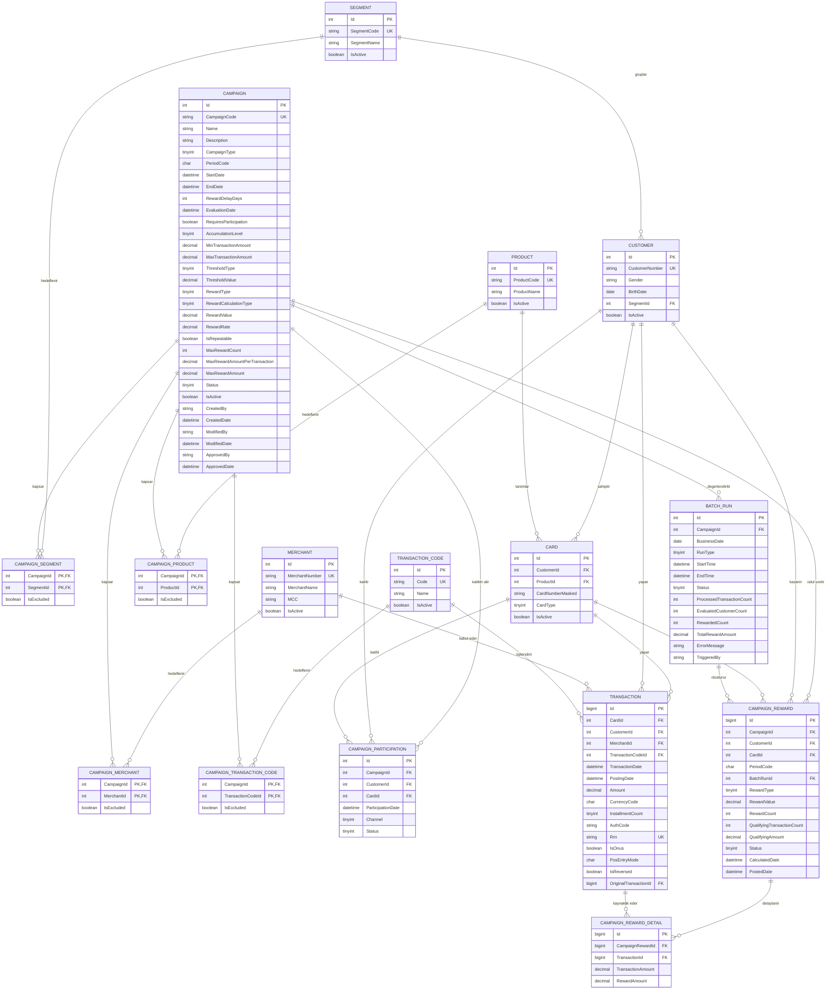

# CampaignSystem — Veritabanı Tasarımı

Kredi kartı batch kampanya tanımlama ve değerlendirme sistemi.

## İş akışı

1. Kampanya aylık olarak tanımlanır (iş geliştirme birimi)
2. Kampanya onaylanır ve yayına alınır
3. Müşteriden katılım alınır (kampanya katılım gerektiriyorsa)
4. Kampanya süresi boyunca müşteri işlemleri birikir
5. `EndDate + RewardDelayDays` gününde batch koşar
6. Koşullara uyan işlemler tespit edilir, ödül hesaplanır ve yüklenir

Değerlendirme **tek seferliktir** — batch kampanya bitiminde bir kez çalışır.

---

## ER Diyagramı



---

## A. Referans Tabloları

### SEGMENT
| Kolon | Tip | Not |
|---|---|---|
| Id | int | PK, identity |
| SegmentCode | nvarchar(10) | UNIQUE, NOT NULL |
| SegmentName | nvarchar(100) | NOT NULL |
| IsActive | bit | default 1 |

### PRODUCT
Kart ürünü (Classic, Gold, Platinum vb.)

| Kolon | Tip | Not |
|---|---|---|
| Id | int | PK |
| ProductCode | nvarchar(10) | UNIQUE, NOT NULL |
| ProductName | nvarchar(100) | NOT NULL |
| IsActive | bit | default 1 |

### MERCHANT
| Kolon | Tip | Not |
|---|---|---|
| Id | int | PK |
| MerchantNumber | nvarchar(20) | UNIQUE, NOT NULL (BKMID) |
| MerchantName | nvarchar(200) | NOT NULL |
| MCC | nvarchar(4) | Merchant Category Code, index |
| IsActive | bit | default 1 |

### TRANSACTION_CODE
| Kolon | Tip | Not |
|---|---|---|
| Id | int | PK |
| Code | nvarchar(10) | UNIQUE, NOT NULL |
| Name | nvarchar(100) | NOT NULL |
| IsActive | bit | default 1 |

### CUSTOMER
| Kolon | Tip | Not |
|---|---|---|
| Id | int | PK |
| CustomerNumber | nvarchar(20) | UNIQUE, NOT NULL |
| Gender | char(1) | null — E / K |
| BirthDate | date | null |
| SegmentId | int | FK → SEGMENT, null |
| IsActive | bit | default 1 |

### CARD
| Kolon | Tip | Not |
|---|---|---|
| Id | int | PK |
| CustomerId | int | FK → CUSTOMER, NOT NULL |
| ProductId | int | FK → PRODUCT, NOT NULL |
| CardNumberMasked | nvarchar(19) | `4321****1234` — **açık kart no tutulmaz (PCI DSS)** |
| CardType | tinyint | 1=Asıl, 2=Ek |
| IsActive | bit | default 1 |

Index: `(CustomerId)`

---

## B. Kampanya Tanım Tabloları

### CAMPAIGN

**Tanım**

| Kolon | Tip | Not |
|---|---|---|
| Id | int | PK |
| CampaignCode | nvarchar(20) | UNIQUE, NOT NULL — örn. `GDO17` |
| Name | nvarchar(200) | NOT NULL |
| Description | nvarchar(1000) | null |
| CampaignType | tinyint | 1=Mass, 2=Hedefli |
| PeriodCode | char(6) | `202608` — aylık dönem kodu |

**Süre ve değerlendirme**

| Kolon | Tip | Not |
|---|---|---|
| StartDate | datetime2 | NOT NULL |
| EndDate | datetime2 | NOT NULL |
| RewardDelayDays | int | Bitiş sonrası bekleme (+x gün) |
| EvaluationDate | datetime2 | `EndDate + RewardDelayDays` — batch bu alanı sorgular |

**Katılım ve seviye**

| Kolon | Tip | Not |
|---|---|---|
| RequiresParticipation | bit | Katılım şart mı |
| AccumulationLevel | tinyint | 1=Kart Bazlı, 2=Müşteri Bazlı |

**Koşul**

| Kolon | Tip | Not |
|---|---|---|
| MinTransactionAmount | decimal(18,2) | null — işlem başına alt sınır (örn. 250) |
| MaxTransactionAmount | decimal(18,2) | null — işlem başına üst sınır |
| ThresholdType | tinyint | 1=İşlemAdedi, 2=ToplamTutar |
| ThresholdValue | decimal(18,2) | 4 (işlem) veya 3000 (TL) |

**Ödül**

| Kolon | Tip | Not |
|---|---|---|
| RewardType | tinyint | 1=Puan, 2=EkstreIndirimi |
| RewardCalculationType | tinyint | 1=EşikBazlı, 2=Oransal, 3=İşlemBaşınaSabit |
| RewardValue | decimal(18,2) | null — eşik veya işlem başına kazanç (1 puan / 50 TL) |
| RewardRate | decimal(5,2) | null — oransal kampanyada yüzde (`5.00` = %5) |
| IsRepeatable | bit | Sürekli Kazanım — eşik her katlandığında tekrar kazanır |
| MaxRewardCount | int | Maksimum ödül adedi (0 = sınırsız) |
| MaxRewardAmountPerTransaction | decimal(18,2) | null — **işlem başına** kazanç tavanı |
| MaxRewardAmount | decimal(18,2) | null — **kampanya toplamı** kazanç tavanı |

İki tavan alanı birbirinden farklıdır:

- `MaxRewardAmountPerTransaction` → tek bir işlemin kazandırabileceği en yüksek tutar
- `MaxRewardAmount` → müşterinin/kartın bu kampanyadan kazanabileceği en yüksek toplam tutar

İkinci tavanın **kart bazında mı müşteri bazında mı** uygulanacağını `AccumulationLevel` alanı belirler. Ayrı bir alan gerekmez.

> **Örnek:** Opet'te %5 ekstre indirimi, işlem başına max 25 TL, kampanya boyunca max 100 TL
> → `RewardCalculationType=2`, `RewardRate=5.00`, `MaxRewardAmountPerTransaction=25.00`, `MaxRewardAmount=100.00`

**Durum ve denetim**

| Kolon | Tip | Not |
|---|---|---|
| Status | tinyint | 1=Taslak, 2=OnayBekliyor, 3=Onaylı, 4=Yayında, 5=Tamamlandı, 6=İptal |
| IsActive | bit | default 1 |
| CreatedBy | nvarchar(50) | NOT NULL |
| CreatedDate | datetime2 | NOT NULL |
| ModifiedBy | nvarchar(50) | null |
| ModifiedDate | datetime2 | null |
| ApprovedBy | nvarchar(50) | null — **maker ≠ checker** |
| ApprovedDate | datetime2 | null |

Index: `(Status, EvaluationDate)` — batch'in kampanya seçim sorgusu

### Kriter ara tabloları

Dördü de aynı şablonda:

**CAMPAIGN_SEGMENT** · **CAMPAIGN_PRODUCT** · **CAMPAIGN_MERCHANT** · **CAMPAIGN_TRANSACTION_CODE**

| Kolon | Tip | Not |
|---|---|---|
| CampaignId | int | PK, FK → CAMPAIGN |
| *(SegmentId / ProductId / MerchantId / TransactionCodeId)* | int | PK, FK |
| IsExcluded | bit | **0 = dahil et, 1 = hariç tut** |

`IsExcluded` alanı ekranlardaki "Hariç" listelerini karşılar. Ayrı tablo açmaya gerek yoktur.

---

## C. Katılım

### CAMPAIGN_PARTICIPATION

| Kolon | Tip | Not |
|---|---|---|
| Id | int | PK |
| CampaignId | int | FK → CAMPAIGN, NOT NULL |
| CustomerId | int | FK → CUSTOMER, NOT NULL |
| CardId | int | FK → CARD, null — kart bazlı kampanyada dolu |
| ParticipationDate | datetime2 | NOT NULL |
| Channel | tinyint | 1=SMS, 2=Mobil, 3=İnternet, 4=POS, 5=ÇağrıMerkezi |
| Status | tinyint | 1=Aktif, 2=İptal |

UNIQUE: `(CampaignId, CustomerId, CardId)`

> `IsEligible` alanı bu tabloda **yer almaz**. Katılım müşterinin isteğidir; uygunluk batch'in kararıdır. İkisi ayrı kavram.

---

## D. İşlem Verisi

### TRANSACTION

Batch'in okuyacağı ana tablo. En büyük tablo olacak.

| Kolon | Tip | Not |
|---|---|---|
| Id | **bigint** | PK — int yetmez |
| CardId | int | FK → CARD, NOT NULL |
| CustomerId | int | FK → CUSTOMER, NOT NULL — kart/müşteri seviyesi için ikisi de |
| MerchantId | int | FK → MERCHANT, null |
| TransactionCodeId | int | FK → TRANSACTION_CODE, NOT NULL |
| TransactionDate | datetime2 | İşlemin yapıldığı an |
| PostingDate | datetime2 | Hesaba yansıdığı gün |
| Amount | decimal(18,2) | NOT NULL |
| CurrencyCode | char(3) | `TRY` |
| InstallmentCount | tinyint | default 1 |
| AuthCode | nvarchar(10) | null |
| Rrn | nvarchar(24) | null — işlemin benzersiz iş anahtarı |
| IsOnus | bit | Kendi bankamızın POS'u mu |
| PosEntryMode | char(2) | null |
| IsReversed | bit | İptal/iade edildi mi |
| OriginalTransactionId | bigint | null, FK → TRANSACTION (self) |

Index:
- `(CustomerId, TransactionDate) INCLUDE (Amount)` — batch'in ana sorgusu
- `(CardId, TransactionDate)`
- `(MerchantId)`
- UNIQUE filtered `(Rrn) WHERE Rrn IS NOT NULL` — mükerrer yükleme koruması

---

## E. Batch ve Sonuç

### BATCH_RUN

| Kolon | Tip | Not |
|---|---|---|
| Id | int | PK |
| CampaignId | int | FK → CAMPAIGN, null (null = toplu koşum) |
| BusinessDate | date | **İş günü — `DateTime.Now` değil** |
| RunType | tinyint | 1=Otomatik, 2=Manuel, 3=YenidenKoşum |
| StartTime | datetime2 | NOT NULL |
| EndTime | datetime2 | null |
| Status | tinyint | 1=Çalışıyor, 2=Başarılı, 3=Hatalı |
| ProcessedTransactionCount | int | default 0 |
| EvaluatedCustomerCount | int | default 0 |
| RewardedCount | int | default 0 |
| TotalRewardAmount | decimal(18,2) | default 0 |
| ErrorMessage | nvarchar(max) | null |
| TriggeredBy | nvarchar(50) | null |

### CAMPAIGN_REWARD

| Kolon | Tip | Not |
|---|---|---|
| Id | bigint | PK |
| CampaignId | int | FK → CAMPAIGN, NOT NULL |
| CustomerId | int | FK → CUSTOMER, NOT NULL |
| CardId | int | FK → CARD, null |
| PeriodCode | char(6) | `202608` |
| BatchRunId | int | FK → BATCH_RUN, NOT NULL |
| RewardType | tinyint | 1=Puan, 2=EkstreIndirimi |
| RewardValue | decimal(18,2) | Kazandırılan toplam |
| RewardCount | int | Eşiğin kaç kez katlandığı |
| QualifyingTransactionCount | int | Koşula uyan işlem adedi |
| QualifyingAmount | decimal(18,2) | Koşula uyan toplam tutar |
| Status | tinyint | 1=Hesaplandı, 2=Onaylandı, 3=Yüklendi, 4=İptal |
| CalculatedDate | datetime2 | NOT NULL |
| PostedDate | datetime2 | null |

**UNIQUE: `(CampaignId, CustomerId, CardId, PeriodCode)`**

Bu kısıt çift ödülü veritabanı seviyesinde engeller. Batch yanlışlıkla iki kez koşarsa ikinci koşum hata alır, sessizce mükerrer kayıt oluşmaz. Kod kontrolüne güvenmeyin, kısıtı koyun.

### CAMPAIGN_REWARD_DETAIL

Hangi işlemlerin ödülü doğurduğunu tutar.

| Kolon | Tip | Not |
|---|---|---|
| Id | bigint | PK |
| CampaignRewardId | bigint | FK → CAMPAIGN_REWARD, NOT NULL |
| TransactionId | bigint | FK → TRANSACTION, NOT NULL |
| TransactionAmount | decimal(18,2) | İşlem tutarı (o günkü hali) |
| RewardAmount | decimal(18,2) | Bu işlemden kazanılan — oransal kampanyada işlem başına değişir |

Müşteri "neden puan almadım" veya "puanım eksik" dediğinde tek dayanağınız bu tablodur. Boyutu büyür ama izlenebilirlik için gereklidir.

---

## Ödül hesaplama mantığı

Batch önce koşula uyan işlemleri süzer, sonra `RewardCalculationType` alanına göre üç moddan birini uygular.

### Mod 1 — Eşik Bazlı (`RewardCalculationType = 1`)

Ödül birikime göre. *"4 harcamaya 1 puan"*

```
RewardCount = FLOOR(QualifyingTransactionCount / ThresholdValue)   -- ThresholdType = 1
RewardCount = FLOOR(QualifyingAmount / ThresholdValue)             -- ThresholdType = 2

IF IsRepeatable = 0   THEN RewardCount = MIN(RewardCount, 1)
IF MaxRewardCount > 0 THEN RewardCount = MIN(RewardCount, MaxRewardCount)

RewardValue = RewardCount * Campaign.RewardValue
```

**Örnek:** 4 harcamaya 1 puan, müşteri 9 uygun harcama yapmış, Sürekli Kazanım açık
→ `FLOOR(9 / 4) = 2` → **2 puan**

### Mod 2 — Oransal (`RewardCalculationType = 2`)

Ödül her işlemin kendisinden. *"Opet'te %5 ekstre indirimi"*

```
FOR EACH uygun islem:
    islemOdulu = islem.Amount * RewardRate / 100
    IF MaxRewardAmountPerTransaction IS NOT NULL
        islemOdulu = MIN(islemOdulu, MaxRewardAmountPerTransaction)
    CAMPAIGN_REWARD_DETAIL'e yaz

RewardValue = SUM(islemOdulu)
```

**Örnek:** %5 indirim, işlem başına max 25 TL. Müşteri 300 TL + 800 TL yakıt almış
→ `300 × %5 = 15 TL` · `800 × %5 = 40 TL → 25 TL'ye çekilir` → toplam **40 TL**

### Mod 3 — İşlem Başına Sabit (`RewardCalculationType = 3`)

*"Her satış işlemine 2 puan"*

```
RewardCount = QualifyingTransactionCount
IF MaxRewardCount > 0 THEN RewardCount = MIN(RewardCount, MaxRewardCount)
RewardValue = RewardCount * Campaign.RewardValue
```

### Son adım — her modda uygulanır

```
IF MaxRewardAmount IS NOT NULL
    RewardValue = MIN(RewardValue, MaxRewardAmount)
```

Bu tavan, `AccumulationLevel` değerine göre **kart** veya **müşteri** toplamı üzerinden uygulanır.

---

## Referans verileri

Sistemin ilk kurulumunda yüklenecek örnek veriler.

### SEGMENT (Müşteri Grubu)

| SegmentCode | SegmentName |
|---|---|
| OGR | Öğrenci |
| PER | Şirket Personeli |
| CFT | Çiftçi |
| EVH | Ev Hanımı |
| EMK | Emekli |

### PRODUCT (Ürün Kodu)

| ProductCode | ProductName |
|---|---|
| 201 | Visa Klasik |
| 202 | MasterCard Klasik |
| 203 | Visa Gold |
| 204 | MasterCard Gold |
| 205 | Platinum Plus |
| 206 | Platinum Plus Metal |

### MERCHANT (Üye İşyeri)

| MerchantNumber | MerchantName | MCC |
|---|---|---|
| 000145 | Grande Cafe | 5812 |
| 000912 | Köfteci Yusuf | 5812 |
| 000874 | Opet | 5541 |

MCC: `5812` = Yeme-İçme, `5541` = Akaryakıt İstasyonu

### TRANSACTION_CODE (İşlem Kodu)

| Code | Name |
|---|---|
| SA | Satış |
| NA | Nakit Avans |
| OD | Borç Ödeme |

---

## Örnek kampanya tanımı

*"Temmuz akaryakıt kampanyası" — Çiftçi ve Şirket Personeli segmentindeki Gold ve üstü kart sahiplerine, Opet'te yapılan 250 TL üzeri satış işlemlerinde %5 ekstre indirimi. İşlem başına max 25 TL, kampanya boyunca kart başına max 100 TL.*

**CAMPAIGN**

| Alan | Değer |
|---|---|
| CampaignCode | GDO17 |
| PeriodCode | 202607 |
| StartDate / EndDate | 2026-07-01 / 2026-07-31 |
| RewardDelayDays | 10 |
| EvaluationDate | 2026-08-10 |
| AccumulationLevel | 1 (Kart Bazlı) |
| MinTransactionAmount | 250.00 |
| RewardType | 2 (Ekstre İndirimi) |
| RewardCalculationType | 2 (Oransal) |
| RewardRate | 5.00 |
| MaxRewardAmountPerTransaction | 25.00 |
| MaxRewardAmount | 100.00 |

**Kriter ara tabloları**

| Tablo | Satırlar |
|---|---|
| CAMPAIGN_SEGMENT | CFT, PER |
| CAMPAIGN_PRODUCT | 203, 204, 205, 206 |
| CAMPAIGN_MERCHANT | 000874 (Opet) |
| CAMPAIGN_TRANSACTION_CODE | SA |

Tek bir kampanya için **8 ara tablo satırı**. Bu satırlar kampanyanın kapsamını tanımlar; kod tarafında hiçbir sabit değer yoktur.

---

## Tasarım kuralları

- Para ve puan alanları **`decimal(18,2)`** — asla `float` / `double`
- `Status` alanları **`tinyint` + C# `enum`** — string kullanılmaz
- Tüm tanım tablolarında **audit alanları** zorunlu
- Açık kart numarası **hiçbir tabloda tutulmaz** (PCI DSS)
- İş günü **parametreden okunur**, `DateTime.Now` kullanılmaz
- Silme işlemi **soft delete** (`IsActive = 0`) — kayıt fiziksel silinmez

---

## Kapsam dışı bırakılanlar (v2)

- **CAMPAIGN_PROGRESS** — kampanya ortasında "3 harcama yaptın, 1 kaldı" göstermek istenirse gerekir. Tek seferlik değerlendirmede gerekmez.
- **Genel kriter modeli** — kriter sayısı 15'i geçtiğinde `CampaignCriteria` + `CampaignCriteriaValue` yapısına geçilir. Şu an 4 ara tablo yeterli.
- **Ayrı onay tablosu** — çok adımlı onay akışı gerekirse `CAMPAIGN_APPROVAL` eklenir. Şimdilik `ApprovedBy` / `ApprovedDate` yeterli.
